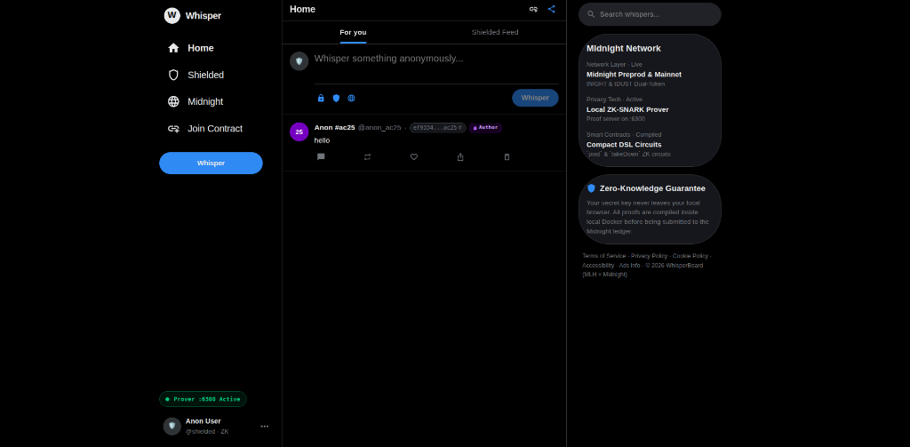

#  WhisperBoard — Anonymous Group Feedback on Midnight

> **Speak freely. Stay anonymous.** Built for the **MLH × Midnight Hackathon** (August 28–30, 2026).

[](https://midnight.network/)
[](https://docs.midnight.network/)
[](LICENSE)

---

##  Quick Links
-  **Demo Video (≤ 2 Min):** *(https://www.youtube.com/watch?v=rgt2bESOK5c)*
-  **Devpost Submission:** *(https://devpost.com/software/whisperboard-y7fcrh)*
-  **Midnight Documentation:** [docs.midnight.network ↗](https://docs.midnight.network/)

---

##  Preview



---

##  What is WhisperBoard?

**WhisperBoard** is a decentralized, zero-knowledge anonymous feedback and discussion feed built on the **Midnight Network**. Users can post candid thoughts, whistleblowing reports, or team feedback to a shared timeline without exposing their identity or wallet address—while retaining cryptographic ownership to delete their posts via ZK proofs.

---

##  Key Features & Engineering Highlights

###  1. Multi-Board Feed Discovery (Core Innovation over Baseline)
*The baseline `example-bboard` is a single-contract, single-message board.* **WhisperBoard transforms this into a scalable social network feed:**
- **Automated Instance Orchestration**: Every whisper seamlessly compiles and deploys an independent Compact smart contract instance on Midnight.
- **Dynamic Feed Discovery**: Aggregates distributed contracts into a unified real-time stream using `localStorage` caching and **URL parameter state synchronization (`?boards=addr1,addr2`)**.
- **Cross-Client Feed Sharing**: Users can click **"Share Feed"** to copy a link that instantly loads all active contract instances on any remote browser.

###  2. Mathematical Anonymity via ZK-SNARKs
- **Zero Identity Leakage**: No wallet addresses, cookies, or personal metadata are stored on-chain.
- **Local-First Witness Generation**: Proving keys and private witnesses are evaluated on your local device via Midnight's Docker proof server (`:6300`). Sensitive keys never touch the network.

###  3. Selective Disclosure & ZK-Proven Ownership
- **Author-Only Deletion**: Only the original creator possesses the private witness to authorize a takedown on-chain.
- **Deterministic Pseudonyms**: Authors are tagged with unique identifiers (e.g. `Anon #ac25`) and custom gradient avatars calculated from contract commitment hashes.

###  4. Interactive Threaded Comments
- Click the **💬 Comment icon** on any whisper to open an inline response box and build threaded anonymous conversations beneath posts.

###  5. Authentic X (Twitter) 3-Column UI
- Pitch-black (`#000000`) canvas, crisp hairline dividers (`#2f3336`), live prover health indicator (`● Prover :6300 Active`), and intuitive micro-interactions.

---

##  Architecture

```
whisperboard/
├── contract/                   # Compact Smart Contract & ZK Circuits
│   └── src/
│       ├── bboard.compact     # Compact DSL contract ('post' & 'takeDown' circuits)
│       ├── witnesses.ts       # Private state witness provider
│       └── managed/bboard/    # Generated ZKIR, proving keys, and TS bindings
├── api/                        # Shared Midnight.js API Layer
│   └── src/index.ts           # DeployedBBoardAPI, state$ RxJS streams
├── bboard-cli/                 # Docker proof server runtime configuration
│   └── proof-server-local.yml # Docker compose for midnightntwrk/proof-server:8.0.3
├── bboard-ui/                  # React 19 + TypeScript + Vite Frontend
│   └── src/
│       ├── components/
│       │   ├── ComposeBar.tsx # X-style inline compose box with ZK proving stepper
│       │   ├── Board.tsx      # Tweet feed row with threaded comments & ZK delete
│       │   └── Layout/        # X 3-Column layout (XSidebar, XRightRail, Header)
│       └── contexts/          # BrowserDeployedBoardManager & RxJS observers
└── docs/                       # Screenshots and visual media
```

---

##  Privacy Model: What's Public vs. What's Private

| Attribute | Public (On-Chain) | Private (Local Client Only) |
|---|:---:|:---:|
| **Message Content** |  Visible | — |
| **Contract Address** |  Visible | — |
| **Poster Wallet Address** |  **Hidden** |  Stored locally in browser |
| **Author Secret Key** |  **Hidden** |  Stored in memory / Lace |
| **ZK Ownership Witness** |  **Hidden** |  Evaluated on `:6300` |

---

##  Quick Start Guide

### Prerequisites
- **Node.js** v22+
- **Docker** with Compose v2
- **Lace Wallet** browser extension ([Chrome Web Store](https://chromewebstore.google.com/detail/lace/gafhhkghbfjjkeiendhlofajokpaflmk))

### 1. Clone & Install
```bash
git clone https://github.com/YOUR_USERNAME/whisperboard.git
cd whisperboard
npm install
```

### 2. Start Local Proof Server
```bash
cd bboard-cli
docker compose -f proof-server-local.yml up -d
cd ..
```

### 3. Launch the Application
```bash
cd bboard-ui
# For Midnight Preview Network:
npm run build:preview
npm start
```
Open **`http://localhost:8085`** in your browser.

---

##  Lace Wallet Setup

1. Open **Lace** $\rightarrow$ switch network to **Midnight Preview** (or **Preprod**).
2. Ensure Proof Server is set to **`http://localhost:6300`**.
3. Fund your wallet from the [Midnight Preview Faucet](https://midnight-tmnight-preview.nethermind.dev/) (or [Preprod Faucet](https://midnight-tmnight-preprod.nethermind.dev/)).
4. Go to **Tokens** $\rightarrow$ **Generate tDUST** to enable transaction gas fees.
5. Connect to **`http://localhost:8085`** and start whispering! 

---

##  Technology Stack
- **Network:** Midnight Network (Layer-1 with zero-knowledge dual-state ledger)
- **Smart Contracts:** Compact DSL compiled via `compactc 0.31.0`
- **SDK:** `@midnight-ntwrk/midnight-js`, `@midnight-ntwrk/dapp-connector-api`
- **Frontend:** React 19, Material-UI, Vite, RxJS
- **Prover:** Dockerized `midnightntwrk/proof-server:8.0.3`

---

## 👥 Hackathon Team & Event
- **Event:** MLH × Midnight Hackathon (August 28–30, 2026)
- **Theme:** Building production-ready, privacy-first applications on Midnight
- **License:** Midnight Network
